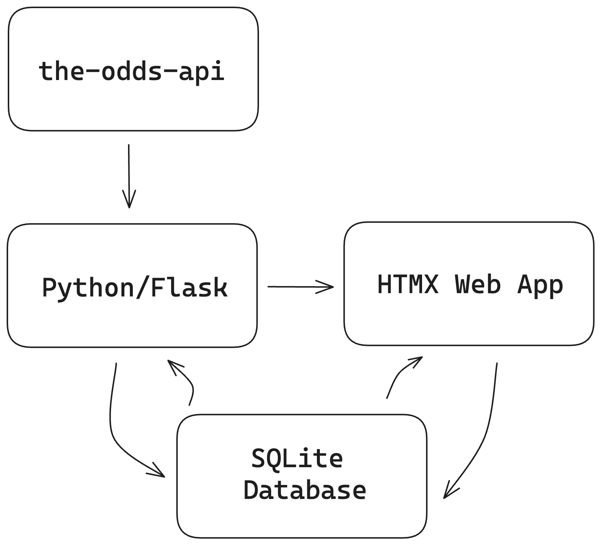
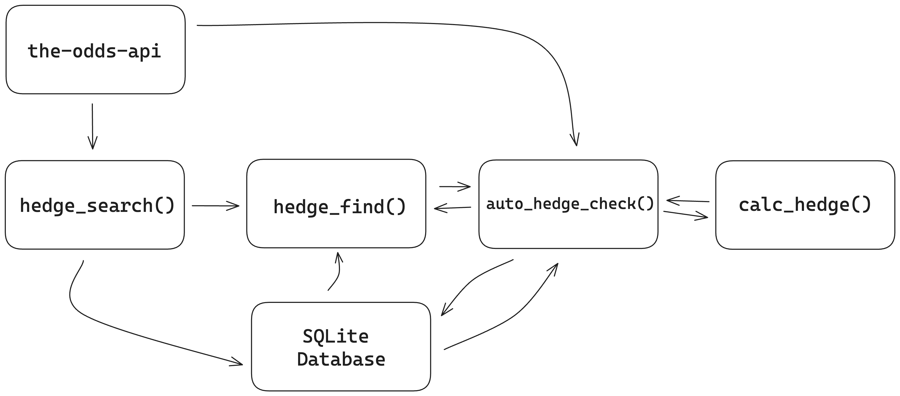
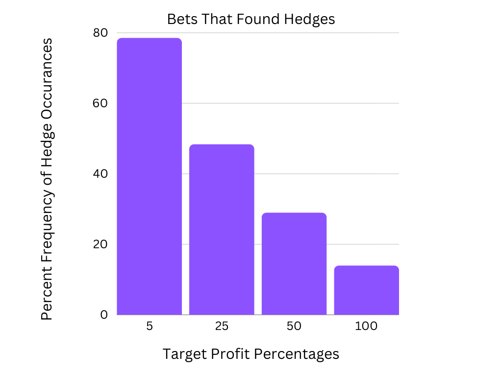
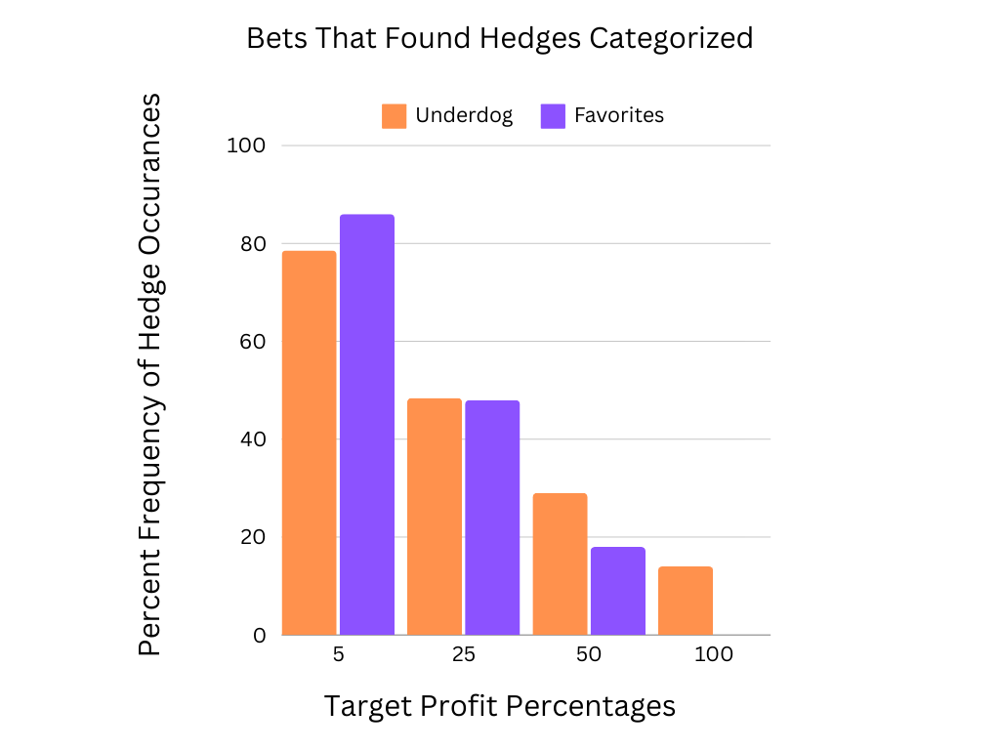
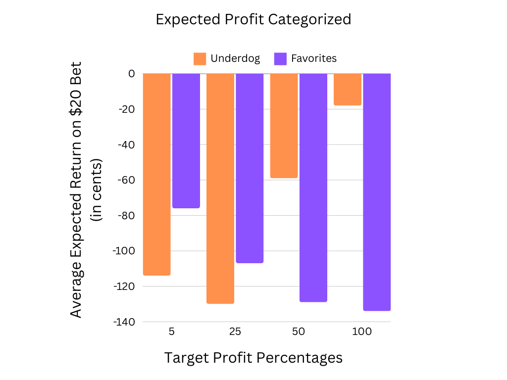

# Introduction

This thesis presents a detailed study and development of an application focused on sports betting odds, with an emphasis on identifying, optimizing, and notifying users about hedging opportunities. Hedging in sports betting involves placing wagers on both outcomes of a binary betting option to ensure a profit, irrespective of the final result. Such opportunities are found when the odds are structured so that the total payout exceeds the sum wagered. These opportunities typically occur during live betting situations, where a bettor places a bet either before or during a game, and due to events during the game, the odds change dramatically enough to allow the user to ensure profit by betting on the other option. These opportunities typically occur when betting on an underdog, a team that is not favored to win. Additionally, this thesis conducts a data analysis of 63 randomly selected NBA games to determine the probability and profitability of various hedging strategies.

## Motivation

The impetus behind this research stems from two principal aims. The first is to create an application where a bettor can inform the application of a bet they made on another platform, and the application will be able to mathematically determine and notify the bettor if there is a hedging opportunity available, and inform them of what they would need to bet to maximize profit. The second aim is to contribute to the body of knowledge in sports betting by analyzing NBA betting odds, focusing on the profitability of hedging your bets and when a bettor should do so. This part of the research aims to provide insights into the mechanics and strategic use of hedging bets. The overarching goal is to offer a tool that not only aids bettors in making more informed decisions but also helps in curbing the adverse effects of gambling, such as addiction and financial losses.

While this research focuses on the intricacies of efficient sports betting practices through trial and analysis, the goal of this research is not to maximize profit. For this reason, it would not be advised to use this application or research to inform high-stakes gambling in search of large sums of profits. The target audience for this application and research is casual gamblers who would like some more information and tools to enhance their sports viewing and betting experience. The type of person that this app and research would be the most relevant to would be the person who maybe sits down and watches whatever games they find interesting on TV and bets on them, but would likely never bet more than $20 in a night unless there was some special occasion. Research into enhancing the experience for this kind of bettor is sparse, and valuable since the majority of gamblers gamble this way.

This tool and research are necessary due to the rapidly growing size of the sports betting industry and the lack of research regarding betting strategies and tools that can be used to both increase profitability and decrease gambling addiction risk. Most of the research done thus far has been conducted in Europe which has completely different gambling laws and regulations as well as a very different sports culture than what is seen in America, so there must be more research done in the U.S. to assess the impact and potentially positive strategies and tools that can make sport betting safer and more entertaining for United States residents. Though there are major differences, valuable insights can be taken from the research that has been done in Europe thus far. In Europe alone, the gross gaming revenue of sports betting was 41.7 billion Euros in 2020, with 55% of all bets being placed during the course of a sporting event. [@MichelsOttingLangrock2023] Meanwhile, little research has been done to examine how users can maximize their odds during live betting scenarios, and the implications using a hedging strategy might have on profitability and the prevalance of problematic gambling habits.

## Current State of the Art

The landscape of sports betting research, particularly in the context of hedging strategies, is currently limited. Most of the available literature is focused on markets outside the United States, or it concentrates on predicting outcomes of sports events and identifying bets with favorable odds. This thesis distinguishes itself by not predicting outcomes or assessing odds fairness. Instead, it focuses on presenting users with profitable betting options based on current market conditions and data from the-odds-api. [@theoddsapi23] A significant aspect of this research is the historical analysis of sports betting odds, an area that has not been thoroughly explored in existing literature. This analysis extends beyond theoretical models, providing a practical examination of historical outcomes and trends in sports betting odds.

### Arbitrage

One distinction that needs to be clear is the terminology and phenomena that I am describing throughout this research. There is a similar concept in the world of sports betting commonly referred to as arbitrage. However, this is not within the scope of the paper, nor commonly possible or legal in the United States. Arbitrage, as commonly defined is the concept of finding sportsbooks that have odds on the same event that vary enough that you can place bets on both sides of the bet and profit instantaneously, due to the discrepancy in odds at one specific point in time. In Europe, this can also be done via secondary betting markets where a user can sell their position, however, these markets are illegal in the United States. The concept of sports betting arbitrage for all intents and purposes can be compared to stock market arbitrage, a common investment strategy where an investor profits off of the price discrepancy between two different markets. 

Hedging a bet, on the other hand, is when you take advantage of odds that are changed by events in the game, by betting on both sides of a bet. In practice this would occur when you make an initial bet on a game of Team A versus Team B, say you bet $20 on Team A at odds of +100 which would yield you $20 profit if it wins for a total of $40. Then, due to some events in the game, you could bet on Team B at +400 odds, meaning you can win $4 for every dollar you bet. At this point, you could bet $10 on Team B which would be a successful hedge. This is because now if Team A wins you win $40 from that bet and wagered $30 on Team A and Team B combined, and if Team B wins you win $40 for that bet and once again only wagered $30. These situations are most likely in games that swing wildly or when one team is heavily favored over the other. The concept of arbitrage is what spurred my interest in investigating the implications of hedge betting within U.S. markets, but it is not the focal point of this paper, nor is it possible in the U.S. the same way it is in Europe. Using arbitrage to profit has been explored before. Researchers were able to secure a guaranteed 19.2% profit using an arbitrage strategy in 2012. [@egonetal2012arbitrage] Proving that arbitrage is a very viable strategy. This prompted curiosity into whether similar results could be replicated using a bet-hedging strategy. 

## Goals of the Project

The thesis is structured around two primary objectives. The first is a comprehensive analysis of the odds of NBA games to ascertain the occurrence and profitability of hedging opportunities in comparison to traditional betting strategies. The second objective is the development of an application that pulls in real time odds data to identify and notify users of hedging opportunities and how to take advantage of them. These two objectives go hand in hand because all data used for the analysis was obtained using the application that was developed. This analysis will explore questions such as the optimal timing for placing hedging bets and how often these opportunities occur and when they are a favorable option when compared to sticking with your bet. Furthermore, it will examine the financial implications of this strategy, providing a clear picture of its potential profitability.

## Ethical Implications

This thesis acknowledges the significant ethical considerations inherent in sports betting. A primary concern is ensuring that the application and its recommendations do not inadvertently foster gambling addiction or encourage irresponsible betting practices. This involves a commitment to promoting responsible gambling, providing users with information that highlights safe betting habits and the potential risks associated with gambling. Compliance with legal and regulatory standards in sports betting is another crucial aspect of this research, ensuring that the project adheres to the ethical and legal frameworks governing the industry. By addressing these ethical issues, the thesis aims to make a positive contribution to the sports betting field, enhancing user experience while promoting responsible and ethical gambling practices.

These concerns are addressed by a few key strategies that aim to mitigate the risk of gambling addiction. First, the application does not allow the user to place bets using it, nor will it handle money of any kind. Also, the unique position and niche of this research should enable users to avoid or mitigate many of the traditional pitfalls of gambling. Research indicates that live betting is traditionally problematic for users, and much of the negative behavior is linked to the feeling of having input and options in real time, as well as the ability to chase your losses using the "cash out" button found on most modern sportsbooks, that allow you to settle your bets early for an amount tied to the probability of your bet winning. [@KillickAndGriffiths2020] My application takes some of this control out of your hands by taking attention away from the betting platform and the especially dangerous "cash out" button, and instead putting you in a place where you are given live accurate information on how and where you can profit. This should theoretically remove some of the emotional decision making that typically causes gamblers losses and feeds into problematic gambling tendencies. Additionally, my application automates the process of finding hedges, encouraging users to not be actively on their betting apps and instead to enjoy the game.

There is another somewhat related ethical risk, which is this work and app being heavily limited by third-party risk, which cannot be eliminated. Due to the lack of regulation around sports betting and the fact that the industry's progression is currently outpacing regulation, it is hard to verify the accuracy of the odds data we are receiving. While conducting this research and testing my application I have manually verified the accuracy of the data I am receiving from *the-odds-api*, but this is in no way conclusive or comprehensive. Additionally, *the-odds-api* gives no information on how it can access all of the odds across different sportsbooks and makes no promises about the integrity or reliability of its data. [@theoddsapi23] This introduces a fundamental risk regarding the longevity and reliability of the findings of this project and the long term maintainability of the application. However, throughout research and testing, there have been no signs that the data is in any way inaccurate or compromised, but the risk remains. This means it must be acknowledged that this application can make no promises of 100 percent accuracy, and anyone who chooses to use the application should verify the accuracy of the data it provides **before** placing any wagers. Unfortunately, this is a problem inherent to the industry at this point in time. Even sportsbooks such as *DraftKings* will not offer any guarantees about the integrity of their own data and make sure to explicitly state as much in their terms of use. [@draftkings2023] This is a problem that cannot be avoided if any investigation into sportsbook odds data is conducted, thus my strategy of gathering and verifying data is as thorough as possible at this point in time.

# Related work

Most of the research relevant to this topic has centered around the psychology of betting decisions and gambling addiction, attempts at algorithmically predicting outcomes, or inherent human biases that cloud sound betting decisions. My research works to learn from all of these works and add to sparsely available literature regarding sports betting. Through research, it seems that the foundation for the vast majority of negative outcomes for casual bettors occurs due to a lack of knowledge or understanding. This is why my research focuses on providing bettors more information as to what their options are during a live betting situation and what actions will allow them to profit or protect themselves from losses the best.

## Lack of Research

There is a very clear void in the current academic landscape when it comes to betting in the U.S. A variety of useful topics have been explored in Europe, however many of these findings are irrelevant to U.S. bettors due to different laws and regulations. Specifically when it comes to hedging strategies, it was hard to find any reliable literature on the subject, especially within the context of U.S. betting laws. There is a variety of research into the pitfalls of gambling addiction when it comes to sports betting, particularly how marketing and the advent of mobile sports betting have exacerbated problem gambling. [@KillickAndGriffiths2020] However, little research has been done into the efficacy of different betting strategies. As well as how third party tools could inform users and ward off some of the typical factors that enhance the addictive tendencies of sports betting.

This makes this work even more crucial, because while the negative impacts of sports betting have been explored it is equally as important to research how these negative aspects can be curbed. One thing that related works have made clear, is that bettors do not often make sound betting decisions and that these decisions can lead to losses on behalf of the bettor. [@MichelsOttingLangrock2023] This raises concern for my work because unlike arbitrage, hedging relies on the bettor initially making a bet that aligns with the future outcome which has been shown to be difficult. However, hedging provides an opportunity for users to capitalize on a sporting event taking a turn in their preferred direction by locking in profits before the event has a chance to turn the other way. This should provide more opportunity for the user to win. Additionally, by providing the user a tool to quickly be notified of these occurences, they will have opportunities for profit that are unavailable to those who look for opportunities manually or are unaware of hedging. There is also the fact that more information is always better, when it comes to making good betting decisions, so providing users with information on their options will always be a net positive. Additionally, due to the construction of the application users must take their attention away from the emotion fueling sportsbook apps in order to monitor hedging opportunities, which will cut down on many of the factors that fuel problem gambling that sportsbooks often try to spur.

## Lack of Knowledge 

The concept that many casual bettors can act against their own best interest due to a lack of knowledge has been explored before. Researchers investigated the betting outcomes of a few particular bettors during the 2015-2016 English Premier League season, where Leicester FC had majorly outperformed expectations. They had started the season with 5000 to 1 odds to win the league, meaning a bettor could bet $1 to win $5000, and some people took this bet. As the season progressed and Leicester continued performing well, sportsbooks offered a cashout option on this bet allowing users to settle their bet for huge profits, but less than what they would receive if their bet won. Of those interviewed, everyone who placed this bet took the cash out option which cost them a collective 8,173.47 that they would have earned had they hedged their bet instead of cashing out. The conclusion is, that users chose to take the cashout option because it is much easier to understand, and right there in their face on the betting app. [@NewallandCortis2019]

This case study shows how bettors can make decisions detrimental to themselves due to a lack of knowledge about what their options are. A common argument against hedging is that more capital is required in order to place the hedge bet. However, the line of thought that this could be a limiting factor, or potentially harmful to the bettor is not supported by sound logic. Firstly, my research is focused on casual gamblers, who use sports betting to enhance their sport entertainment experience. In this case, a bettor would typically not be betting more than they can afford to hedge in order to receive guaranteed profits. Even in the case where a bettor has placed a bet so large that they cannot afford to hedge, in many cases they could take out a loan in order to hedge, and still profit after paying the interest on the loan. While this is an unlikely course of action for a casual gambler, it illustrates the point that hedging is rarely negative. Fundamentally, the resistance to hedging is often linked to a lack of knowledge about the strategy. This is why my research aims to simplify and inform bettors about hedging, and take much of the mental load and math involved in calculating a successful hedge off of the bettor's shoulders.

## Emotion Driven Betting

In order to successfully produce a tool and data that is beneficial to bettors, it is crucial to have an understanding of the casual bettors' betting habits and what underlying factors drive their decisions. This is a very complex question that cannot be answered within the scope of this thesis. However, there are themes and indicators that can be drawn from previous research that inform this work. Many of the pitfalls that casual sport bettors often fall into can be traced back fundamentally to them letting their emotions fuel their betting decisions rather than sound logic and math. This can lead to bettors making decisions against their own interest due to the heat of the moment exacerbated by the introduction and prevalence of live betting.

Studies have shown that during live betting scenarios bettors will typically over react to positive events that occur during the game and place additional bets accordingly typically leading to losses, which causes the odds to move accordingly. [@MichelsOttingLangrock2023] This shows that most bettors are not able to accurately estimate the effect that in game events have on bet probabilities. While this research does not investigate how this relates to hedging strategies, it sheds light on some interesting phenomena. Firstly, it shows that bettors in aggregate typically over react to in game events. Next, the odds of said bet then move accordingly due to the wave of incoming bets. This would indicate that at this point there is a discrepancy between the actual probability of an outcome, and the odds currently being offered. Which in theory, could be taken advantage of by a bettor.

This particular occurence highlights a broader issue that bettors are often unable to correctly asses risk and reward, which hinders bettors' abilities to profit and make sound bets. While this is not eliminated by this work, the only way to decrease the prevalence of these circumstances is to provide bettors with more conclusive and comprehensive information about the consequences of their bets and the options available to them. This is why this work provides bettors with another avenue to profit from their bets. While this tool does not provide comprehensive information, the use of this application will hopefully nudge users to be more thoughtful and informed in their bets, increasing overall performance.

## Connection

This research situates itself in a niche not often explored by broader literature. This position is the implications of hedging on betting profitability, and aims to explore how this strategy can be used and when. Due to the lack of related works, the scope of this thesis becomes inherently larger. In connection to the more specific goals, this thesis must also answer questions about its connection to problematic gambling habits, U.S. gambling laws and regulations, and data integrity among many more. The app and related historical odds data analysis together serve to address the questions surrounding the efficacy of hedging strategies as they pertain to sports betting while maintaining an ethical position.

Much of the previous literature around the topic of sports betting rightfully points out many of the negative effects that sports betting and gambling as a whole can have on people. However, not many attempts have been made to investigate strategies and tools that can mitigate the negative effects of sports betting, without abolishing it or handicapping the industry. Which allows this tool and research to fill that void by equipping both researchers and bettors with a tool and chest of information that allows them to make more informed, safe betting decisions. 

Sports betting in specific, deserves more attention and research because of the interesting position that it finds itself in amongst the broader category of gambling. Most forms of gambling such as blackjack, craps, slot machines, and lottery tickets are inherently net negative games, meaning that even when played perfectly, the gambler will always lose money in the long run or in other words can never "beat the house". Sports betting on the other hand provides the potential to beat the house, because the house has no control over the outcomes of sporting events. The advantage that sportsbooks have over bettors is simply knowledge and scale and they have been able to use this advantage to profit handsomely. [@MichelsOttingLangrock2023] While the scale aspect cannot be addressed by research, the knowledge gap can. By closing the knowledge gap the playing field between bettors and sportsbooks can be closed, minimizing losses on the end of bettors. To provide bettors with information about implications and options when placing bets is to minimize the risks and harmful effects of betting while making it a more enjoyable experience for the bettor which is what this research accomplishes.

# Method of approach    

The method of my research centers around the application I have developed which facilitates the finding of hedging opportunities though a straight forward web interface. To accomplish this I used Python, Flask, HTMX, and SQLite. I used Python and Flask. Flask was particularly helpful because it enabled the easy integration of SQL databases, as well as recurring jobs using their APScheduler. Python was the obvious choice due to my familiarity with the language and its ability to enable the development of powerful applications quickly. HTMX was very helpful in developing the web portion because it enabled me to have all of the functionality I wanted on the front-end without having to overcomplicate my application with a ton of JavaScript code. Lastly, SQLite was the optimal database choice for this project because it allowed me to easily add, change and store data on the fly as the application evolved, and allowed for quick and easy querying to conduct my experiments. 

## Usage

To illustrate the purpose, use case and function of the app let's investigate a theoretical user Bob. Bob is someone who enjoys getting home from work, cooking a nice meal, and turning on the NBA games for the night so that he can keep up to date with his favorite league. While doing so Bob occasionally enjoys placing a few small wagers on the game whenever he really has a gut feeling about an upcoming game or his favorite teams or players are playing. The issue is Bob doesn't have the time to do in depth research before every game and can't shake the feeling that he isn't making optimal decisions, but doesn't have the time or know how to spend time filling out spreadsheets and analyzing sports and betting data before placing his bets. So what does he do instead? He opens up his sportsbook app of choice, and plunges head first into the countless betting options and distracting graphics and promotions that plague all sportsbooks.

That's where the Hedgemaster comes in. Now, whenever Bob places a bet on his sportsbook of choice, he can simply go in to the Hedgemaster and relay the information about the team, the odds, the hedge profit percentage threshold and the bet amount into the app and Hedgemaster handles the rest. Then, Bob can put his phone down, and enjoy the games distraction free, without the complexities of trying to navigate and monitor the sportsbooks during the game. Then if a hedging opportunity arises at Bob's desired profit level he will know what team to bet on, how much to bet, what his total stake will be, and what his guaranteed profit will be. Finally, all Bob has to do if he wishes to capitalize is go back on the sportsbook, place the bet with the information provided on the app, and sit back and enjoy the game and his profits.

In this example both Bob's betting and viewership experience has been enhanced. First, Bob was able to place a well informed bet without having to worry about checking his phone every 2 minutes to see if the odds had changed. Then Bob was able to enjoy the game, without the distraction of stressing about whether or not there may be a better bet to place. Finally, Bob was able to rest assured knowing that if an opportunity to profit off of his bet presented itself that he would be able to instantly capitalize on it without having his sportsbook open at all times.

## Ethical Implementation

As previously mentioned, there are clear ethical implications regarding my project and the possible worsening of problematic gambling habits. To combat these concerns, my application has been strategically designed to at the very least not perpetuate if not lessen the risk factors that lead to problem gambling. My application takes a multifaceted approach to reduce problem gambling. First and foremost, UI design plays a key role in limiting the addictiveness of online sports betting. Major sportsbooks's applications are designed to encourage users to place bets and stay on the app. They accomplish this using flashy colors, quick and accessible gambling options, and menus that are difficult to navigate to locate the exit and withdrawl options. My design eliminates these pitfalls by being minimalistic, easy to navigate, bland, and information centric. 

This implementation focuses on bringing information to the forefront of the user's attention, without any distracting and possibly addictive design qualities. Having the logout button at the top of the page makes it very easy for users to exit out of the application whenever they wish to end their session. Then, in the center of the page, you have both the ability to search the current odds, as well as search for hedging opportunities which are the two main focuses of the app. Finally, at the bottom of the page, users are able to see all of the bets that they have already placed, making it more difficult for them to ignore their past bets and excessively gamble. This list of bets also provides users with additional information in the form of concrete data on their past betting and spending habits allowing them to make better decisions moving forward. These features contrast that of a traditional betting site or a casino, where it is easy to get lost in flashy interfaces with no information other than what bets you can place and the always easy to find deposit button.

Information is the primary weapon a user can use to both stave off overly cumbersome losses as well as problematic gambling habits. Which is why I have chosen an information first design, where all elements of the implementation assist the user in getting helpful, comprehensive, and easy to access and understand information throughout their duration on the app. In the name of this, my application will also allow users to track their spending, as well as allow them to set limits and warnings for themselves if their spending exceeds certain thresholds over predetermined periods of time. It should once again be emphasized, that this application is in no way intended for a professional gambler. This application targets the casual gambler who wishes to enhance the enjoyment, outcome, and safety of their at home recreational sports betting experience. Which is why the app does not facilitate the placing of bets, make outcome predictions, or accept money in any way. Instead, the application focuses on showcasing odds, possibilities and hedge situations allowing users to make their own informed betting decisions. In the process, users using this app will not be on their sportsbook of choice where they are enabled and encouraged to make poor decisions. [@MichelsOttingLangrock2023] 

## Accounts

One of the most crucial features of my implementation is the ability to create and access personalized user accounts. Aside from the fact that storing users' information is crucial to the functionality of my tool, user accounts enable the privacy of the highly sensitive betting data that this application needs to collect in order to function. All passwords are encrypted and secured in a private database, allowing for the safe and convenient access and storage of user accounts.

Additionally, the creation of user accounts also enables most of the key features of my application to function properly. For one, the accounts allow for personal betting and spending history to be stored so that users may track their bets and spending over time. Having all the bets stored per account enables the constant checking for hedge opportunities, while also cutting down on the amount of API requests that the application needs to make in order to effectively find hedging opportunities.

Accounts in my application are kept very simple, and don't require users sacrificing personal information in order to sign up and use the app effectively. The only information that users need to provide to create an account is a username, a password, and a phone number if they would like to receive text notifications. If users wish to take the extra step to ensure their privacy and omit their phone number, they are still able to use the app just as effectively, having their bets and spending logged and having hedging opportunities found. The only difference between a phone number and a non-phone number user is that users who elect to offer their phone number will receive text notifications automatically when a hedging opportunity occurs even when they are not signed in or using the app, whereas those who don't will have to check for hedging opportunities manually within the app. This minimal process streamlines and eases the path to users quickly receiving beneficial betting data while simultaneously minimizing the app's complexity. 

All the while, accounts preserve the privacy of the user. First, by making sure users' betting data are not publicly available, which is very important due to the stigma surrounding gambling as well as the financial nature of the data. While also, not requiring any personally identifiable data in order to sign up, eliminating much of the risk that would typically be associated with a data breach if that were to occur.

## The API

The main driver of the functionality of my project is the-odds-api, an API which gives both real time and historical sports betting odds for over 70 sports and over 40 bookmakers. [@theoddsapi23] While relying upon this API as heavily as this application does poses plenty of third-party risk, there are few alternatives. No bookmakers that I could find have public facing APIs or scrapable interfaces. There are competitors that offer services similar to the-odds-api, however these services pose the same risk as the-odds-api which is untestable data accuracy. In my experience the-odds-api has proven to be the fastest, easiest to use, and reliable in all instances which I have manually tested it.

The only thing that is required to implement this API is an API key, which I was able to easily acquire via there website. From there, the only thing to do is to begin making API requests. The API accepts many parameters, but for the purposes of this project the important ones are as follows: `API_KEY`, `SPORT`, `REGION`, `MARKET`, and `ODDS_FORMAT`. Many of these are self-explanatory, but the key ones to understand are `SPORT` and `MARKET`. `SPORT` allows you to select the sport that you wish to get data about, whereas `MARKET` allows you to select what type of bets you would like to receive such as moneylines, over/unders, or player prop bets. This research focuses on the moneyline bets or `h2h` market. This is because other forms of bets may change during the course of a game such as over/under where the actual over/under line will shift thoughout a game making it very difficult to track and calculate hedges. Whereas a moneyline bet can never change in that way, instead the bookmakers will adjust the odds of the moneyline event to account for events that occur during the game, which is the exact phenomenon that allow for hedging. The `SPORT` setting can be changed at will, because regardless of the sport, moneyline bets will still be present.

Part of the power of the-odds-api is the sheer amount of information that can be collected from a single API request, which is important to us because API requests are a finite resource on this service. A basketball moneyline request for example will return every single moneyline bet available in the NBA from every single bookmaker that the service tracks. This is a vast amount of data that can be used to find hedging opportunities for every user on the application all at once due to the bets being stored with the users. This allows the program to for example analyze and find hedging opportunities for every single basketball bet all users have made with a single API request. The limiting factor here is that there has to be a new API request for every sport that the app is tracking. 

This flexibility and features that the API provide allow this program to leverage this information to make real-time analyses on every users bets all at once, which powers the effectiveness of this app. My application is then able to parse this data to find what points of data are relevant to the user and the bets that are already being tracked. Then it takes that data and performs calculations to determine where an arbitrage opportunity is possible, and what the most efficient arbitrage opportunity is.

## Implementation

There are three important functions that power the application's ability to find hedging opportunities `hedge_search()`, `hedge_find()`, `auto_hedge_check()`, and `calc_hedge()`. These are the functions that allow the program to take in bets from the web interface and use the data from the API request to give the user information about potential hedging opportunities. The back-end of the app has been written in Python with the Flask framework to enable easy development, data handling, and algorithm implementation. Here is a very high level overview of how the application flows.

As shown the app is powered by a Python and Flask backend which creates a web app for users to interact with this program. Then the data gathered from the users via the web app is then stored in an SQLite database. The application is then able to use that data to find hedges for all users and store these hedging opportunities in the database. There are a few key functions that are able to drive this application and find and calculate hedges for users. This is a diagram of how the app works and interacts slightly simplified for clarity.

The `hedge_search()` function accepts both `POST` and `GET` requests, allowing it to both take data in from the web form, and return data to the web app about potential hedging opportunities. Within this function you will see it takes in all of the data from the web form about a users bet with `bet_team`, `opp_team`, `bet_odds`, `bet_amt`, `bookmaker`, and `target_arb_percent` then stores this data in the database and uses it to find hedging opportunities. It then grabs the all of the current odds from the API, and uses this data to run the `hedge_find()` function to find any potential hedges for the given bet. 

The `hedge_find()` function grabs the odds for the opponent team, then uses the `check_hedge()` function which compares the user odds to the opponent odds to see if a hedging opportunity is available. If it is, it sets the `hedge_opportunity` flag to true, and returns the hedging data. Then if a hedge is not found to hedge is stored in the database to be checked later. Which is done with the `auto_check_hedge()` function that works like so:

This function takes in all of the data about a hedging opportunity and calculates the amount you should bet on the hedge, the total bet amount, the guaranteed profit, and the profit percentage. It uses this data to either send back to the `auto_hedge_find()` function to be stored in the database or produce html output to be displayed on the web.

## Technologies

There are many moving parts to this project and complexities due to the difficult nature of the task at hand. Here will be a brief rundown on the technologies that have been used throughout the development of this project, including how they are useful, why they are necessary, and how they assist in completing the goal of the research project. The main technologies used in this project are: Python, Poetry, Flask, SQL, HTMX, and the-odds-api.

The programming language for the back-end implementation Python was chosen due to its flexibility, variety of features, and my personal familiarity with the language. Python is rich with packages and compatibilities that made it highly suitable for a project with as many moving parts as this one. It has allowed this project to connect to a database, integrate algorithms, hook up to the web via Flask, integrate authentification, and make API requests, all while being smooth to develop and easy to read. These factors made Python the obvious choice to power this app.

To assist in the management of the complexity and moving parts of this project I decided to use the Poetry package manager. This enables the program to run in a virtual environment where all the packages and dependencies can be easily installed, managed, and updated without worrying to much about device compatibility or dependency installation. Poetry is a widely available and utilized Python tool that enables apps to be much more robust as dependencies grow over time, and developers to spend less time worrying about dependency installation, setup and updates.

Flask is a Python framework that allows you to easily and flexibly convert your Python programs into a web app, which made it a very attractive option for this project. There are alternatives out there such as Django, however in my experience Flask is much more flexible, customizable, and well suited for building a project from scratch. Which was necessary for this use case due to the unique features that this project required.

This project needed a way to store data over long periods of time in a way that was secure, accessible and well-organized in order to properly function. This data retention was required in order to enable user profiles, the storage of bets, and the usage of that data to find hedging opportunities, which meant that it needed a database. So, SQL was decided to be the database of choice due to its ease of setup, ability to organize data effectively, and my personal familiarity with the technology.

Due to the need for the constant flow of data to and from the front and back ends of the application, there needed to be a way to easily and dynamically transfer data to from the web page in real time. For that purpose HTMX was chosen which is a JavaScript library that allows you to access AJAX, CSS Transitions, WebSockets, and Server Sent Events directly in HTML, making it easier to create modern, dynamic web applications. This was very useful because it allowed the program to accept `POST` and `GET` requests directly in the HTML. Which cut down on development time and code complexity greatly.

Last but not least, the-odds-api was absolutely crucial to the development of this application. In order to accomplish the research goals a way to aggregate huge amounts of sports odds data was desperately needed. After searching every sportsbook and discovering that none of them had public facing APIs it was a huge relief to find the-odds-api which fulfilled all of our needs. It covers a huge amount of data with each API request, covers almost every sport, bet, and bookmaker in existence giving us a wide range of data to work with. Additionally, it updates odds every 40 seconds giving us frequent, accurate and up to date data, which is crucial for allowing our users to capitalize on quickly waning hedging opportunities. Finally, it also provides historical data, which was crucial for our experiments where we explored how often these arbitrage opportunities occur and how profitable they are versus a more traditional betting strategy. Add that to the fact that it is a very well documented API that was incredibly easy to implement into our Python program, and it was a very easy choice. While there are competitors attempting to provide a similar service none come close to the amount nor quality of features that the-odds-api offers.

# Experiments

In order to test the validity of my application, as well as different hedging strategies, I tested various hedging strategies for 63 random NBA games. These tests were able to verify that my application is able to effectively gather odds from the-odds-api, store user bets accurately, and automatically identify hedging opportunities at the users desired profit percentage. Additionally these simulations offered insights on what hedging strategies are optimal and when. Last these experiments showed that my application is able to run efficiently when used at a medium scale, as it was able to handle and process 2429 hedging opportunities over 504 bets.

## Experimental Design

This experiment was designed to provide a systematic overview of what hedging could look like in practice over the long term. To accomplish this, a large randomly selected set of games was chosen to bet on. The games that were used in this experiment were 63 random games that all occurred between February 28th 2024 and March 11th 2024. For every game in this sample 4 simulated $20 bets were placed for each team of every game. Four bets were used to simulate probably target profit percentages that a user might look for, those being 5, 25, 50, and 100 percent profit. These bets were all stored in a database, where the application reviewed all of the eligible bets every 5 minutes to search for a hedge opportunity, recording every opportunity as it was discovered. These profit percentage thresholds represent 4 different types of potential casual bettors the risk averse bettor, the slightly risk tolerant bettor, the risk tolerant bettor, and the risk seeking bettor. For the evaluation, these four subcategories were broken down once again into those who bet on underdogs and those who bet on favorites. This is because for one, it would be misleading to evaluate hedging opportunities for two sides of the same game at once because no logical bettor would bet on both sides of a game before a hedging opportunity became available, but also because these are realistic betting strategies that give insights on when hedging makes sense.

This setup enabled the evaluation of a variety of hedging strategies over a large sample of games. While it is still prone to variance, 504 bets over 63 different games gives us a fair level of confidence that our data is not heavily manipulated by extreme outliers. Additionally the NBA is the the major American sport where luck has the least influence on the outcome of the games. [@arbesman2012] So this gives even further confidence that variance should be negligible. Using the data from these experiments the efficicacy and profitability of multiple hedging strategies that are symbolic of various types of casual bettors can be properly assessed.

## Evaluation

The key to my evaluation strategy revolves around analyzing underdog bettors, and favorite bettors, and comparing their simulated results as well as the results of those who don't hedge. This was done by simulating the outcomes of every bet that was simulated throughout the experiment and grouping them into different strategies to see which would fair the best over the sample games. First I analyzed what percentage of bets found any hedge at all for each respective profit threshold.

The results show that the 5, 25, 50 and 100 percent profit threshold bets found a hedge 78.57, 48.41, 29.36, and 14.28 percent of the time respectively. This results suggest that hedging opportunities are fairly common especially those with a low-medium profit potential. Additionally it shows that highly profitable hedges are unlikely, they aren't exactly rare either. Keep in mind, that these profit thresholds are a minimum, so the 5 percent profit threshold includes all hedges up to 24.9 percent profit and so on. Granted these results include both sides of a bet from the same game, so they are slightly unrealistic, but still valuable. To account for this, and to simulate a more realistic betting strategy and environment the bets were split into two categories. One being underdog bets, meaning bets on the team less likely to win, and favorite bets, bets on the team that is more likely to win.

This analysis provided more interesting insights on what strategies may be more or less viable. Bets on the favorite team at 5, 25, 50 and 100 percent target profit thresholds were able to find a hedging opportunity 86.15, 47.69, 18.46, and 0 percent of the time respectively. As you may have noticed teams that are the favorite at the beginning of the game are much more likely to yield minor hedging opportunities, but extremely rarely yield high profit hedging opportunities. This is due to the fact that bets on the favorite yield much lower profits to begin with, so the favorite doing well, which is traditionally what would create hedging opportunities has much less room to create profit via a hedge due to the diminishing returns as the profit for betting on the favorite approaches 0. On the other hand, underdog bets at the 5, 25, 50, and 100 percent profit thresholds created a hedging opportunity 70.49, 49.18, 40.98 and 29.51 percent of the time respectively. Thus, it is slightly less likely for underdogs to find hedging opportunities at the lower thresholds when compared to favorites, however it is far more likely for underdogs to create highly profitable hedging opportunities. This is due to the fact that underdogs are far more likely to get blown out from the start of the game when compared to favorites, which would eliminate hedging opportunities. On the other hand, when underdogs perform well the odds shift much more drastically, allowing for much greater profits through hedging. These results suggest that more risk tolerant bettors may want to consider betting on favorites, whereas risk seeking bettors may want to bet on underdogs. However, these results offer very vague insights without investigating the potential profitability of these strategies. To capture this, the theoretical profitability of these strategies was analyzed.

These results are able to paint a much clearer picture of how a bettor may fair if they strictly followed any of the previously outlined strategies. There are some caveats to this analysis. Firstly, it assumes that a bettor who chooses a certain profit percentage will always decide to hedge at the first opportunity they are presented. Also, hedges were only searched for every 5 minutes, which means that there are likely more or less profitable hedging opportunities that were missed, particularly at the end of games where odds can swing wildly and quickly. Regardless, bettors betting only on favorites at 5, 25, 50 and 100 percent profit thresholds could expect -$0.76, -$1.07, -$1.29, and -$1.34 losses per bet respectively over the sample games. As is obvious all of these strategies yielded a net loss. Likewise, bettors who bet on only underdogs at the same thresholds could expect -$1.14, -$1.30, -$0.59, and -$0.18 losses per bet respectively over the sample games. While all of these strategies can expect losses, the results mirror that of the likelihood to find hedging opportunities for each of the given strategies. Also, betting on underdogs, especially at a high percentage profit threshold seems to be the ideal strategy. While it may seem like a fruitless strategy given that most of the strategies averaged somewhere between 2.5 and 6.5 percent losses, there is still value given the sportsbooks will offer odds at an 4.7 to 4.8 percent disadvantage at times. [@barnard2023] Which means these experiments are close to or beating the standard expected return.

To provide a control an analysis of what would have happened had a user not hedged any of their bets during the same sample games was conducted. For this analysis, the bets were again split by underdog and favorite bets. This was done in an attempt to discover whether or not hedging can provide an advantage when compared to simply making bets and living with the outcome. The analysis showed that those who bet on every favorite during these sample games can expect to average a -$1.70 loss per bet. Whereas those who bet on every underdog can expect a $0.23 profit per bet over the sample games. These results seem to indicate that there is a decent advantage when it comes to betting on underdogs that holds true whether you decide to hedge or not. However, not hedging at all was the only strategy that had a category profit. On the other hand, never hedging when betting favorites yielded worse results than all of the favorite betting hedging strategies. This seems to indicate that hedging may be a beneficial strategy when betting favorites, and a detrimental strategy when betting underdogs. Though, the change in results is so small that it may be attributable to pure variance. However, underdogs bets outperformed favorite bets in almost every simulation, so it seems to hold true that betting underdogs may be a slightly beneficial strategy.

## Threats to Validity

There are many factors that could call the results of these experiments into question, as well as many realistic scenarios that were not accounted for during this experiment. Firstly, while simulating bets for most games throughout a given time period removed bias in the analysis, it also poorly simulates a real life casual bettor who would more than likely only bet on teams they have knowledge on or when they think they have an advantage against the house. Likewise, a real bettor would likely not bet the same amount for every single bet they make. Instead they would likely vary their bet sizing based on their confidence in their pick and the odds offered. As stated previously, this was done purposefully so that the research and application make no attempt at predicting the outcomes of games or identifying favorable bets, however this limits the results ability to effectively simulate a real world betor. Also, the sample size could also have swayed the results, while 63 games is a large sample size it only accounts for roughly 2 weeks of games. There could certainly be some natural variance that influenced the outcome of the analysis. Similarly, analysis was only conducted on NBA, there is no telling whether these results would hold true for other sports leagues. The app design also limited the accuracy of the results. Due to the-odds-api being a paid service that charges per API request, it was not feasible to check for hedges anymore often than every 5 minutes. This was especially limiting because towards the ends of close games odds swing severly and rapidly, allowing for highly profitable hedging opportunities, but plenty of these opportunities were likely missed due to the hedge finder's timing. Lastly, like was discussed previously, there is inherent third party risk in relying on one API for all of our odds data, however during the testing and monitoring of this app no discrepancies or errors were explicitly seen with the API. These issues considered, as long as the limitations and scope are kept in mind when absorbing this information. I think the app and experiment showed that hedging is at the very least a net neutral, and there is value in informing bettors of its existence and potential use cases.

# Conclusion

This research provides additional insights into the world of casual sports betting. In doing so, it presents another feasible option for small stakes users who wish to have more control and information during their sports betting sessions. It also reduces the need for a bettor to remain on their sportsbook app at all times to have up to date, reliable, actionable information, which should reduce the inclination to bet problematically. Also this research investigates the possibilities of what innovative applications and strategies can be developed using the wealth of real time knowledge offered by odds APIs, and how they can be used to reduce the house's edge.

## Summary of Results

The results of this application and the experiments indicate that there is potential value in hedging strategies, but this value is not present in all cases. Nor is hedging a particularly effective blanket strategy. However, the application and the results prove that odds APIs can serve as a backbone for powerful large scale applications and that more intricate and informed strategies that utilize hedging and odds APIs may be more effective. The automated detection of hedging opportunities is a topic that has not been explored before, and the results of this application and experiment show that it is an area worth exploring further.

The results of the experiment specifically show that the hedging as whole when done en mass without a broader strategy is typically a net neutral endeavor. However, there are also minor indicators that strategies that utilize betting on underdogs, especially at high target profit percentages have the highest likelihood to be profitable.

## Future Work

There are many ways that these topics can be explored forward moving forward. Mainly, it would be very beneficial for this research to be conducted over a longer period of time with more resources. One of the main limiting factors of this research was the cap on API calls. If data could be pulled more frequently it would result in more accurate data. Likewise, it would be beneficial to test more strategies at different target profit percentages, as well as different samples of games, from other sports leagues as well. It remains unknown whether the results achieved through these studies would hold true in other sports leagues. Answering this question would determine whether my results are specific to basketball or if it is a sports betting wide phenomenon. 

Another interesting way that hedging strategies could be explored would be to test this application with real users, and see how user behavior affects the profitability and likelihood of hedging opportunities occurring. Within this, it could be investigated how often a typical user chooses to hedge, and how often that is the beneficial choice. In this work it is assumed that a simulated user will bet and hedge the same way every single time, which is unlikely to happen with real users. So it would be very insightful to see how real users would use, and profit from this application.

One additional avenue that could be explored is hedging non binary bets, or bets with multiple outcomes. This would complicate the calculations and hedging strategies, but is still possible nonetheless as long as all outcomes are able to be bet on. There has bene a growing interest in parlays and sports betting has become more mainstream, and with it the ability to hedge these parlays. [@nuwwarah2024] Another example of this is betting future, like player awards or tournament results, where hedging can be extremely lucrative if your pick makes it far in the tournament. [@santaromita2022] So an investigation into different hedging strategies with these types of bets could add even more value.

## Future Ethical Implications and Recommendations

If this application were to be adopted by a large user base, the obvious question of whether this could encourage gambling addiction remains. However, this is doubtful due to the research that suggests that the design of the sportsbook apps and user activity on the sportsbook apps is the main driver of problematic sports betting. [@KillickAndGriffiths2020] Whereas my app uses a simplistic straight forward layout and does not accept or facilitate the exchange of money or sports bets in any way. It simply relays information

Another concern, is the third party risk of relying on the-odds-api, as the app survives longer and grows. Firstly, with more users there will be more API requests which drives up costs. Additionally, without some sort of verification process there is no way to guarantee that the API will provide accurate odds indefinitely going into the future. For this app to be scaled up, it might make sense to take data from an additional API and compare the results to each other before presenting them to users in order to further validate the odds.

## Conclusions

The overarching goal of this research is to provide more information to casual sports bettors, and explore a new under-researched strategy for sports betting. Though the strategies specifically explored in this experiment turned out to be roughly a net neutral many valuable insights were gained that warrant further investigation. For one, underdog bets being the favorable option to betting the favorite in nearly every experiment is interesting and confounding. These experiments show that hedging is a viable strategy, even though throughout the studies it resulted to be largely neutral, this is not unexpected considering our experiment did not take into account any other outside strategies that have been shown to boost the odds for the bettor.

Additionally, this application and research should inform and enable the casual sports bettor to make more informed decisions when placing their bets. As discussed, many of the causes of losses and addiction in gambling can be traced back to a lack of information and understand, and being overwhelmed by the options offered by sportsbooks. This application both reduces the users' options and decision points, while also providing accurate up to date information and showcasing profitable opportunities. All together, this should lead to a safer, simpler, more enjoyable sports viewing and betting experience for the casual user, while revealing a lesser known betting strategy to a wider audience.

# References

::: {#refs}
:::
